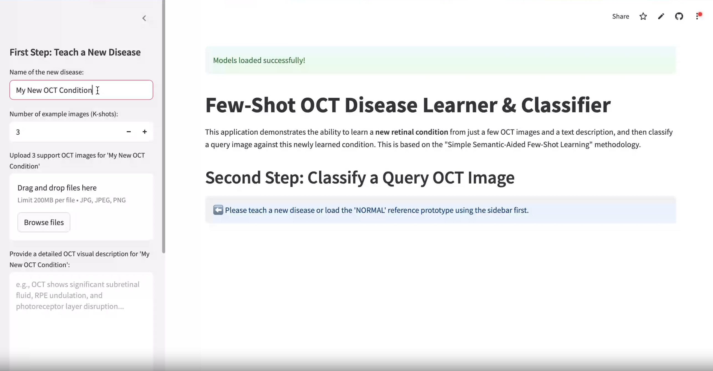
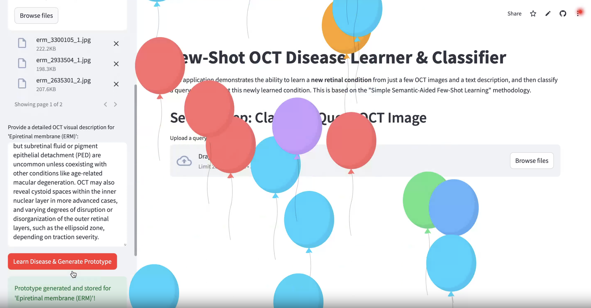
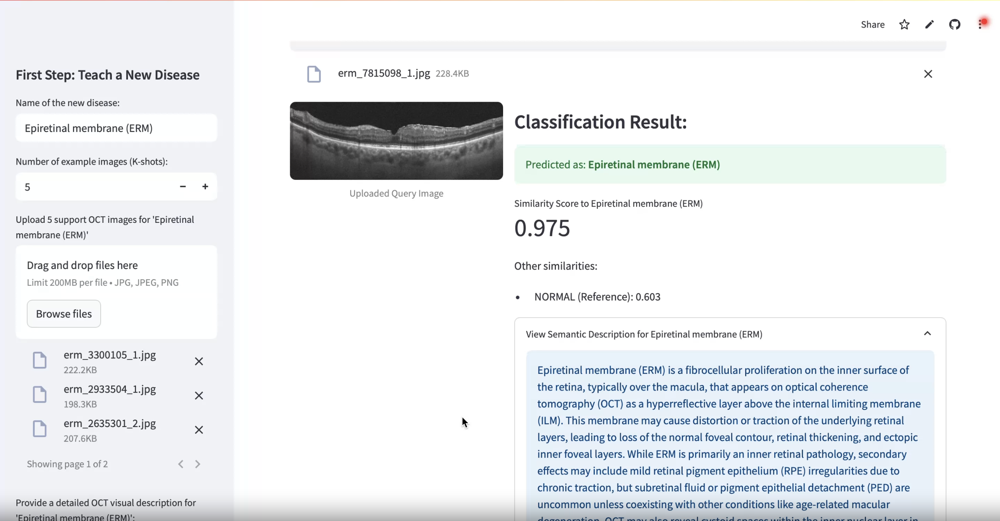
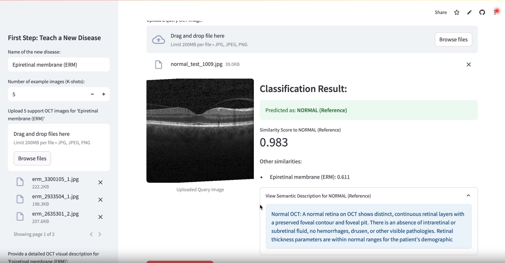

# Semantic-Aided Few-Shot Learning for OCT Retinal Disease Classification

Link to the streamlit app : [click here](https://semantic-aided-fsl-oct.streamlit.app)

**Dataset Used:** 

Retinal OCT Image Classification - C8 (from kaggle) :
[click here to view](https://www.kaggle.com/datasets/obulisainaren/retinal-oct-c8)

## Aim 

This project's aim was to implement a **Few-Shot Learning (FSL)** system that can learn to classify a new OCT disease category from a very small number of examples (K-shots).

To achieve this, the project draws inspiration from the methodology proposed in the paper Simple Semantic-Aided Few-Shot Learning by Zhang et al. (arXiv:2311.18649).

This includes integrating rich semantic descriptions for each classes along with the visual features extracted from the OCT images. 

The goal was to evaluate semantic-aided few-shot learning (FSL) as a means to develop a model capable of classifying novel retinal diseases from OCT scans using limited training data.

## Key Results Achieved

1. **Vision Encoder Fine-tuning (Base Set included: NORMAL, DRUSEN, DME, AMD):**
* Achieved a final accuracy of **98.38%** and loss of **0.0497** on the base classes after 10 epochs. 

2. **SemAlignNet Training (Base Set):**
* The L1 loss for SemAlignNet converged from an initial value of approx. **0.0941** to **0.0082** after 15 epochs.

3. **Fusion Factor K Tuning (Validation Set included: CNV and CSR):**
* Task: 2-way 5-shot
* The optimal fusion factor (k) was found to be **0.5**, which yielded a mean accuracy of **92.90%** on the validation set.

4. **Final Few-Shot Performance (Novel Set includes DR and MH):**
* Task: 2-way 5-shot
* Using the tuned fusion factor (k) as 0.5, the model achieved a mean accuracy of **50.13%** with a **95%** confidence interval of +/- **1.34%** on the novel set over 200 tasks.

## Conclusion 

The project implemented the "Simple Semantic-Aided Few-Shot Learning" (SemFew) methodology for classifying diseases in OCT retinal images using the OCT-C8 dataset.

The fine-tuned vision encoder showed accuracy of 98.38% on the base classes. The SemAlignNet showed good convergence during its training phase, indicating it learned to effectively reconstruct target prototypes using combined features.

When evaluated on the novel set classes DR and MH, the system achieved a mean accuracy of 50.13.
This result indicates challenges in generalizing to this specific pair of novel classes with the current setup.

## Potential Future Work 

The future work would be aimed at improving the accuracy on the novel set. 

it could be to 
* **Refine Semantic Descriptions:** 
* **Automate Semantic Evolution:**

----

**Disclaimer:** This project is for academic purposes. The models and outputs are not intended for clinical diagnosis.

## Screenshots Streamlit app 

<table>
  <tr>
    <td></td>
    <td></td>
  </tr>
  <tr>
    <td></td>
    <td></td>
  </tr>
</table>